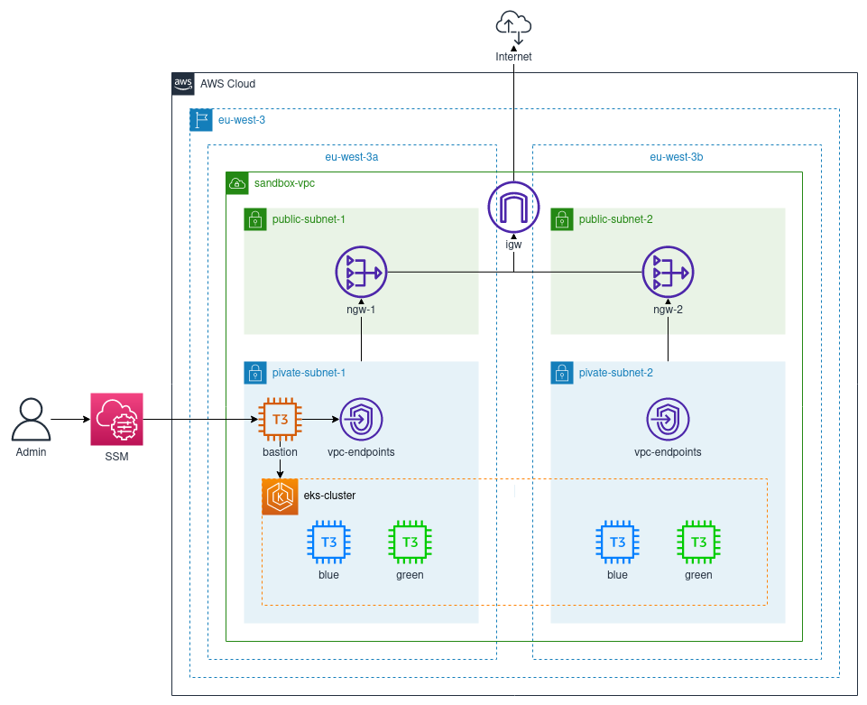

# crossplane-eks

Crossplane configuration files and tools to deploy a private EKS cluster accessible through a SSM bastion instance.

## Features

- Region : eu-west-3
- VPC with a public/private subnet per AZ (a & b)
- Internet/NAT gateways and route tables giving internet access to the private subnet
- VPC endpoints in the private subnets for SSM
- Compute : an EC2 bastion instance and an EKS cluster with blue/green node groups
- IAM and security groups

### Diagram



## Prerequisites

- Root access on an AWS account
- Access to a Kubernetes cluster and a [crossplane deployment](https://crossplane.io/docs/v1.6/reference/install.html) configured with AWS on the master branch
- AWS CLI with the [Session Manager plugin](https://docs.aws.amazon.com/systems-manager/latest/userguide/session-manager-working-with-install-plugin.html), `jq`, `helm`, `kubectl` and [sshuttle](https://sshuttle.readthedocs.io/en/stable/) installed on your machine

## How to

### Setup

**Crossplane**

Deploy the Crossplane Helm chart :

```
helm repo add crossplane-stable https://charts.crossplane.io/stable
helm install crossplane crossplane-stable/crossplane -n crossplane-system --create-namespace=true --set 'provider.packages[0]=crossplane/provider-aws:master'
```

**AWS**

With the root account in the console :

- Create an IAM user with console access and access keys with the AdministratorAccess policy attached

  - Add this to your `~/.aws/credentials` file :

  ```
  [default]
  aws_access_key_id = <your_access_keys>
  aws_secret_access_key = <your_secret_keys>
  role_arn = arn:aws:iam::<your_account_id>:role/administrator
  source_profile = default
  ```

- Create a `crossplane` IAM user with no attached policy and access keys
- Create an `administrator` IAM role with the AdministratorAccess policy attached and a trust relationship allowing the two user above to assume the role

**Why do we do this?**

When creating an EKS cluster, AWS creates a Configmap named `aws-auth` which maps IAM identities to Kubernetes users and groups. If Crossplane creates the cluster only using its user credentials, it will be the only one able to access it.

The trick is if you set the provider's credentials to assume an IAM role that your personal user and Crossplane's user can assume, it will be the one added to the `aws-auth` Configmap, thus granting you access to the cluster from the get go.

**Resources to create manually**

Create these resources manually (no crossplane support yet) :

- **SSH key pair** (create, save and set secure permissions) :

```bash
aws ec2 create-key-pair --key-name bastion | jq -r .KeyMaterial > ~/.ssh/bastion.pem
chmod 600 ~/.ssh/bastion.pem
```

- **IAM instance profile**

```bash
aws iam create-instance-profile --instance-profile-name ec2-ssm-ip
```

### Deploy

- Fill the manifests in the [config](./config) directory with the needed infos
- Apply the [config](./config) manifests
- Apply the whole [resources](./resources) directory
- Link the created `ec2-ssm-role` IAM role to the `ec2-ssm-ip` IAM instance profile
  ```bash
  aws iam add-role-to-instance-profile --instance-profile-name ec2-ssm-ip --role-name ec2-ssm-role
  ```

### Connect to the cluster

Add the cluster's credentials to your kubeconfig :

```bash
aws eks update-kubeconfig --cluster eks-cluster
```

Use the [tunnel script](./tools/tunnel_eks.sh) to connect to the bastion (will need `sudo` for `sshuttle`) :

```
# You can specify the bastion name and cluster name as args 1 and 2 of this script if you changed them
./tools/tunnel_eks.sh
```

Open a new terminal and you should be able to `kubectl` into the created EKS cluster !

## Troubleshoot

If something goes wrong, check the events visible in the description of the resources, the error messages are understandable.

## Destroy

To destroy all the resources, just delete everything from the management cluster.

Delete the resources created with the CLI (the instance profile in particular will block you from destroying everything)

```bash
# SSH key
aws ec2 delete-key-pair --key-name bastion
# Instance profile
aws iam remove-role-from-instance-profile --instance-profile-name ec2-ssm-ip --role-name ec2-ssm-role
aws iam delete-instance-profile --instance-profile-name ec2-ssm-ip
```
